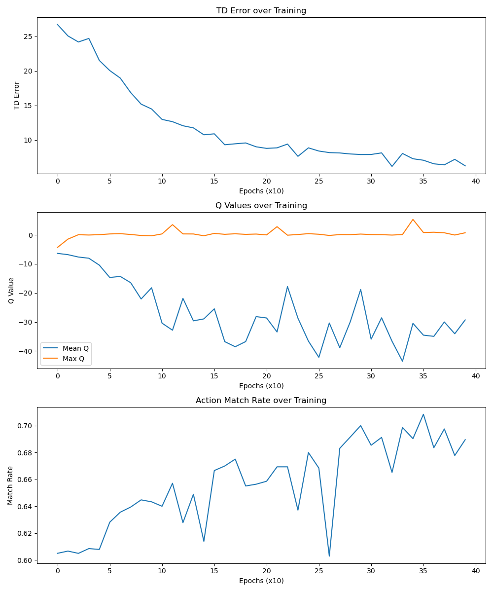

# OFFLINEFMDQN
## Feature
1. Read data serialized by long decision of UOS
2. Deserialize the data
3. Get the trajectory for offline RL
4. Train the FMDQN model using offline trajectory
5. Perform offline testing for the FMDQN model
6. Convert the Python model to C model.


## Usage

1. Install the dependencies

```bash
pip install -r requirements.txt
```


2. Run the script

2.1 deserialization_demo.py
deserialization: tesing demo of feature 1 and 2
```bash
python deserialization_demo.py  data/lon_decision_input_dump.ucrf
```

2.2 observation_demo.py
observation: tesing demo of feature 3
```bash
python observation_demo.py  data/lon_decision_input_dump.ucrf
```
2.3 lon_agent.py
lon_agent: tesing demo of feature 4

```bash
python lon_agent.py  data/lon_decision_input_dump.ucrf-2.6w
```




2.4 test_case.py

tesing demo of feature 5

```bash
python test_case.py data/lon_decision_input_dump.ucrf-ideal2.3w
```

2.5 export_model.py

tesing demo of feature 6

```bash
python export_model.py
```

